# Trusting the PiStock local CA in Firefox

By default, Firefox shows a **"Warning: Potential Security Risk Ahead"** page
when you open the PiStock web UI, because the server uses a certificate issued
by PiStock's own **local CA** rather than a public authority.

This is a **one-time setup per machine**: import the local CA once, and Firefox
will trust the server cleanly — no warning — including across future certificate
renewals (the server leaf is always re-signed by the same CA).

> **What you import:** the local CA certificate, `ca-cert.pem`.
> The PiStock FreeCAD workbench already ships the *exact same file* under the
> name `pistock_ca.pem`, so you can reuse it — no need to copy anything from the
> server.
>
> **Never import** `ca-key.pem` or `key.pem` (private keys) — they stay on the
> server and must never leave it.

---

## Step 1 — Confirm the server is reachable (temporary exception)

Open the PiStock URL in Firefox:

```
https://<PI_IP>:8000/
```

You'll get the security warning. Click **Advanced…** → **Accept the Risk and
Continue**. This adds a *temporary exception* and loads the page.

The only goal here is to confirm the service is up and you're hitting the right
host. We'll remove this exception at the end — it must be gone for the clean
trust to take effect.

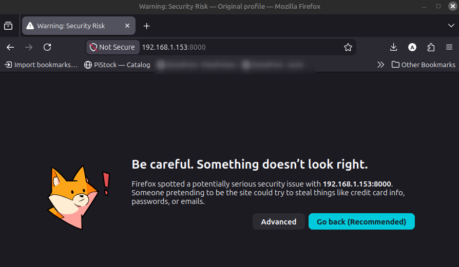
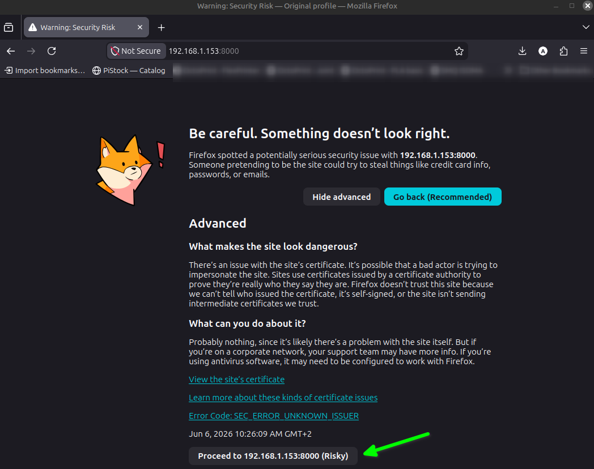
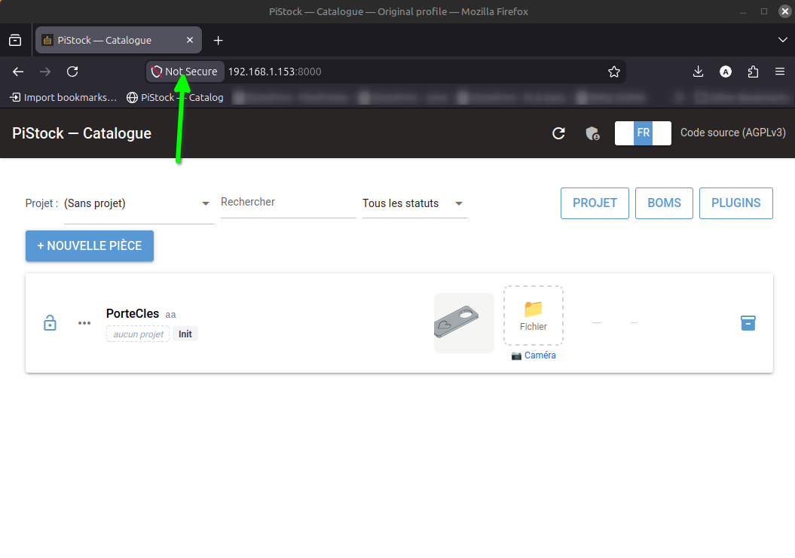

---

## Step 2 — Locate the CA certificate

Use the CA file bundled with the workbench (it is the same `ca-cert.pem`
generated on the server):

```
<FreeCAD Mod folder>/PiStock/.../pistock_workbench/pistock_ca.pem
```

> On the server itself, the identical file is simply `ca-cert.pem` at the
> repository root. Either one works — they are the same local CA.

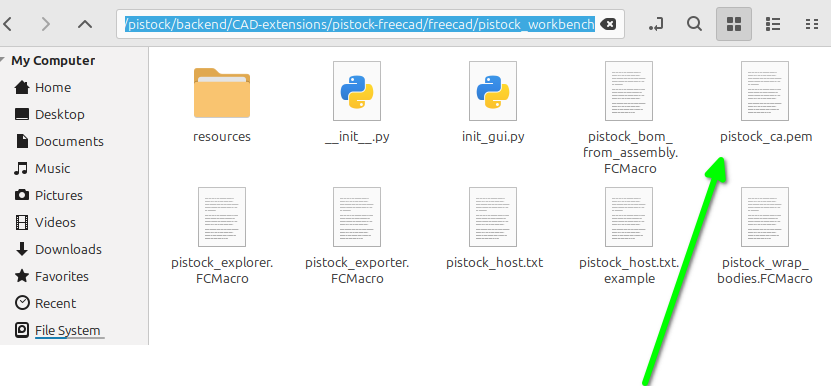

---

## Step 3 — Import the CA into Firefox

1. Open **Settings → Privacy & Security**.
2. Scroll to **Certificates** → click **View Certificates…**.
3. Go to the **Authorities** tab → click **Import…**.
4. Select `pistock_ca.pem` (or `ca-cert.pem`).
5. When prompted, check **"Trust this CA to identify websites."**
6. Confirm with **OK**.

`PiStock Local CA` now appears in the Authorities list.

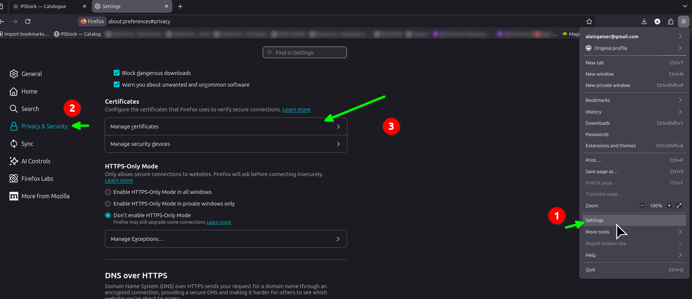
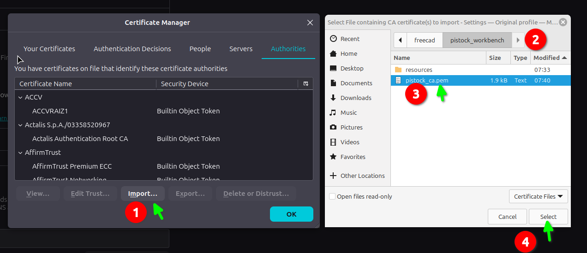
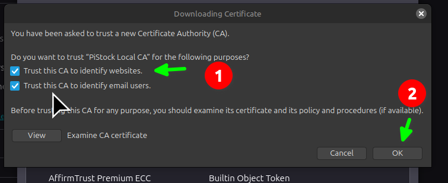
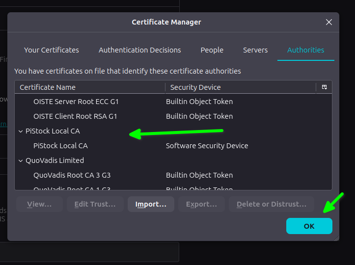

---

## Step 4 — Remove the temporary exception

The exception you added in Step 1 **overrides** normal certificate validation:
while it exists, Firefox keeps applying that one-off decision instead of checking
the chain against the CA you just imported. Remove it so standard validation
takes over.

1. Still in **View Certificates…**, open the **Servers** tab
   (or use **Manage Exceptions…** on the Privacy & Security page).
2. Select the entry for `<PI_IP>:8000`.
3. Click **Delete or Distrust…** (remove the exception).

Reload `https://<PI_IP>:8000/` — the page now loads with no warning. ✅

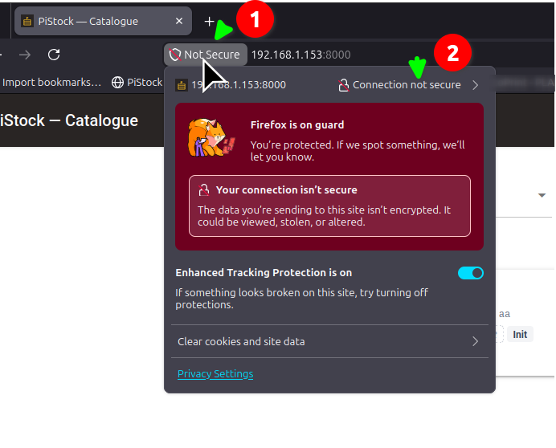
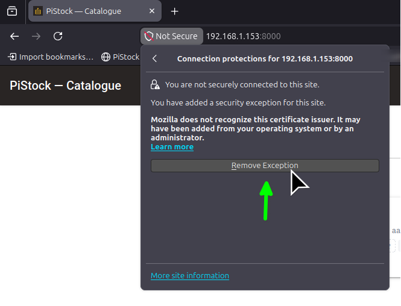
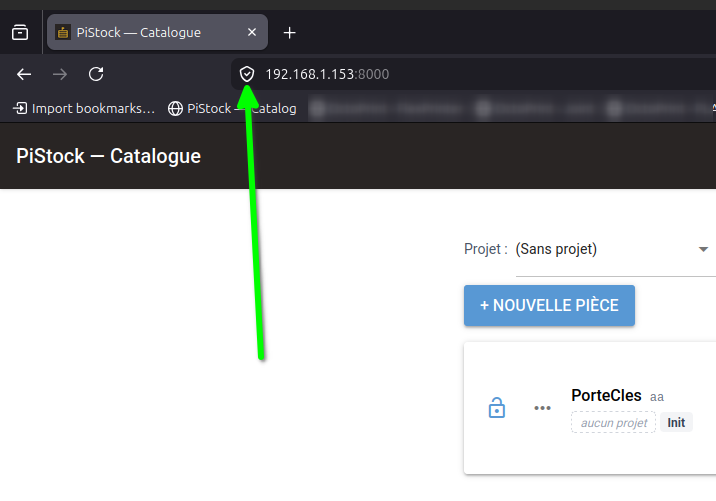

---

## Notes

- **Per browser store.** Firefox uses its **own** certificate store, separate
  from the operating system. Chrome, Edge and Safari use the OS trust store
  instead, so for those browsers you import the same `ca-cert.pem` into the OS
  (e.g. *Trusted Root Certification Authorities* on Windows, Keychain on macOS).
- **After regenerating a certificate.** If you ever click a new exception for a
  changed cert, remember to delete it again (Step 4) — a stale exception will
  mask the correct CA-based behaviour.
- **A real certificate (e.g. Let's Encrypt)** needs none of this: it is trusted
  by every browser out of the box.
